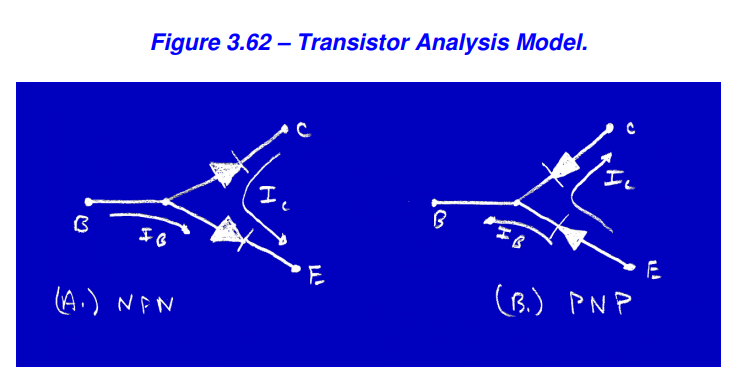
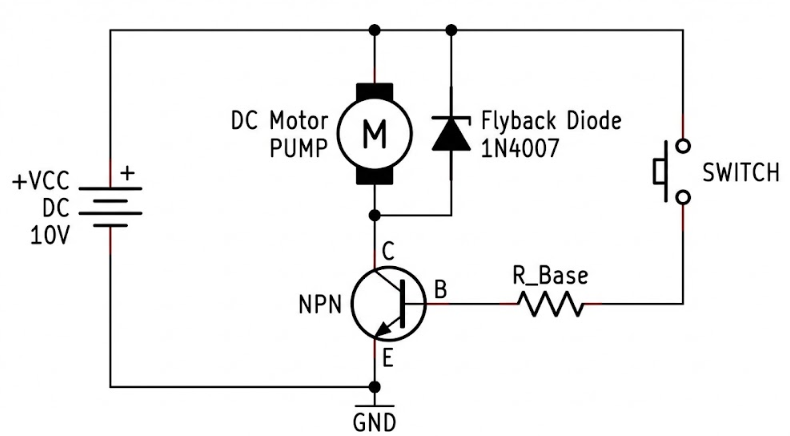
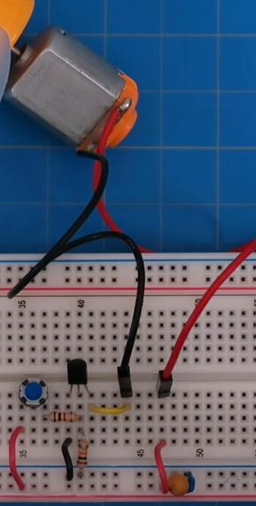

# Transistors

- BJT (Bipolartransistor) makan 0.7V untuk mulai aktif

### berfungsi
* Switch -> Menghidupkan atau mematikan beban secara otomatis menggunakan arus/tegangan kecil.
* Amplifier -> Menggunakan arus/tegangan kecil untuk meng-ON-kan beban yang butuh arus/tegangan lebih besar. Sehingga arus/tegangan kecil bisa menghasilkan output yang lebih besar.

### Layer Transistor
* Base
* Collector
* Emitter

### Jenis Transistor
- Bipolartransistor
    - NPN
    - PNP

### Deep Dives

* NPN
    * Emitter   = dihubungkan ke GND
    * Base     = dikasih arus/tegangan kecil (Sinyal HIGH) maka transistor ON
    * Collector = dihubungkan ke komponen beban
* PNP
    * Emitter   = dihubungkan ke VCC
    * Base     = dikasih arus/tegangan kecil (Sinyal LOW) maka transistor ON
    * Collector = dihubungkan ke komponen (beban) → lalu ke GND

__NPN paling sering digunakan__

* pada NPN -> Arus Emitter = Arus Base + Arus Collector
* Amplification pada transistor NPN
    * IC = β ⋅ IB
    - IE = IC + IB
    - VE = VB - 0.6V
    * dimana:
        * IC = arus collector
        * IB = arus base
        * β (beta) = hFE = faktor penguatan arus transistor

### Mode NPN Transistor
* Mode Saturasi -> switch ON -> untuk mengaktifkannya dengan memberi Arus basis dibuat besar -> 
    * Ib = Ic/Hfe
    * asumsi Hfenya 10 
    * e.g
    * tentukan arus beban ke komponen Ic = 100mA
    * maka Ib = 100mA/10 = 10mA
    * cari resistor dengan ohm's law
    * Rb = (Vcc - Vtransistor)/Ib
    * Rb = (5V - 0.7V)/10mA
    * Rb = 4.3V/10mA
    * Rb = 430 ohm maka bisa pakai 330 ohm
    * maka perlu resistor Rb sebelum masuk ke base transistor
* Mode Cut-off -> switch OFF -> untuk mengaktifkannya dengan memberi Arus basis dibuat nol
* Mode Aktif -> amplifier -> untuk mengaktifkannya dengan memberi Arus basis dibuat kecil

### Rangkaian

__transistor NPN itu "Low-Side Switching" (Saklar Sisi Bawah(pada bagian negatif)) karena e.g menyalakan pompa dengan transistor NPN, power supply + dirangkai dengan kabel positif dari pompa, kabel negatif dari pompa masuk ke collector transistor, ditambah juga diode dengan kabel positif dari diode masuk ke collector transistor dan negatif masuk ke power supply +, dan emitter transistor dihubungkan ke GND, power supply juga dihubungkan dengan momentory switch lalu ke resistor dan dimasukkan ke base transistor__

__Arus listrik (+) sebenarnya sudah standby masuk ke pompa, tapi dia macet tidak bisa mengalir karena jalan pulang ke Ground diputus oleh Transistor NPN di bawah. Begitu Anda tekan tombol, jalan ke Ground terbuka, arus mengalir, pompa nyala.__

__Jika arusnya di bawah 0.5 Ampere atau urusan Suara, pakai Transistor (BJT). Jika arusnya di atas 1 Ampere atau urusan Tenaga, wajib pakai MOSFET.__

### e.g
