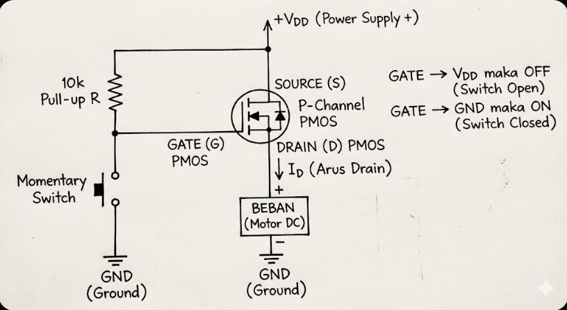

# MOSFET

* sering digunakan untuk switch dan amplifier dibanding dengan transistor
* jadi amplifier jika __VGS sedikit di atas Vth__ dan rangkaiannya pasang resistor di drain, dihubungkan antara drain dan VDD (power supply +), Source ke ground
* intinya :
    * ✔ Drain + resistor → amplifier (common source amplifier) (beban komponen tidak langsung dihubungkan ke drain namun lewat resistor)
    * ✔ Drain + beban komponen langsung → saklar (switch)

### Bagian-bagian MOSFET:
* Gate -> ke sinyal kontrol
* Drain -> ke beban komponen
* Source -> ke ground

### Ada dua tipe utama:
* N-Channel MOSFET (NMOS) 
* P-Channel MOSFET (PMOS) 

### Cara kerja:
* Ketika tegangan Gate cukup besar (disebut Vth – threshold voltage):
    * Terbentuk “kanal” di bawah gate.
    * Elektron/holes bisa mengalir dari Drain -> Source.
    * MOSFET berubah jadi saklar ON.

### Rangkaian
* N-Channel MOSFET (NMOS) 
    .png)
    * e.g
    * Led + lewat resistor dihubungkan ke power supply + 
    * Led - dihubungkan ke Drain
    * Source dihubungkan ke ground
    * Gate dihubungkan ke Sinyal kontrol (Arduino/MCU/dll) (e.g power supply + ke momentory switch ke resistor (dilewatkan positif, negatifnya resistor masuk ke ground) baru ke gate)

* P-Channel MOSFET (PMOS)
    
    * e.g
    * Source dihubungkan ke power supply +
    * Drain dihubungkan ke beban komponen +
    * beban komponen - ke ground
    * Gate dihubungkan ke Sinyal kontrol (Arduino/MCU/dll) (e.g Gate -> resistor (dilewatkan positif, negatifnya resistor masuk ke power supply +) -> momentory switch -> ground)

__N-Channel lebih sering digunakan__

#### VGS -> tegangan pengontrol antara Gate dan Source
#### Vth -> batas minimal VGS untuk mulai ON

### Fungsi MOSFET sebagai Switch
* Gate -> 0V maka OFF
* Gate -> VGS > Vth maka ON (5V atau 10V)

### Fungsi MOSFET sebagai Amplifier
* Gate diberi tegangan di sekitar nilai tengah
* e.g 
* Vth = 2V (estimasi cek didatasheet) maka diberi VGS sebesar 2.5–3V agar MOSFET bekerja sebagai amplifier

__Dalam IoT MOSFET lebih sering digunakan sebagai switch__
