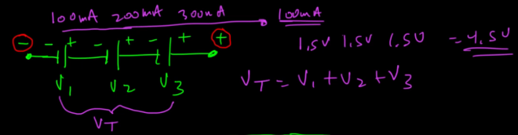
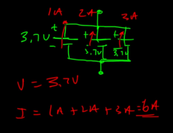

# Current & Voltage
## Current 
- Berapa banyak orang yang melewati pintu putar mall setiap detik.
- Kalau banyak orang lewat per detik → arus besar (ampere besar)
- Kalau sedikit orang lewat → arus kecil
- Muatan (elektron) = orang
- Arus = jumlah orang per detik yang lewat satu titik di koridor

## Voltage
- beda ketinggian air / beda tekanan (dorongan tegangan yang menyebabkan arus)
- Ada dua bak air: satu tinggi, satu rendah di antara dua bak itu ada pipa
Air akan mengalir dari bak yang lebih tinggi ke yang lebih rendah karena beda ketinggian → beda tekanan.
Semakin besar beda ketinggian bak air → semakin kuat tekanan air → air mengalir lebih deras
Semakin besar beda tegangan → “dorongan” ke elektron semakin besar → potensi arus lebih besar

- Tegangan (Voltage) menentukan seberapa besar “dorongan” yang menyebabkan arus (Current) (jumlah elektron mengalir). Jadi kalau gak ada tegangan ya gak ada arus.

- Secara fisis itu dari – ke + (electron bergerak menyebabkan ada hole yang akan diisi electron dibelakangnya)
Namun secara konvensional dari + ke – (hole yang bergerak) (dirangkaian bacanya dari + ke - )

## Generating Voltage
### Ada 3 cara utama untuk menghasilkan tegangan listrik:
-	Reaksi kimia → seperti pada baterai.
-	Medan magnet → seperti pada generator (pembangkit listrik).
-	Efek cahaya (foto-elektrik) → seperti pada panel surya.

## Baterai
- plus -> Anoda
- negative -> Katoda

Voltase dari battery (e.g 1.5V) saat diukur bisa menjadi 1.2V karena didalam battery ada resistor kecil 

## Series & Parallel

* Cara menambah voltase pada battery : Series (supaya alat elektronik yang butuh tegangan lebih tinggi bisa menyala). Skemanya: battery 1 negative dihubungkan ke battery 2 positif, battery 2 negative dihubungkan ke battery 3 positif dst.

 
* Cara menambah ampere pada battery : Parallel (supaya alat bisa berjalan lebih lama tanpa baterai cepat habis (karena ditambah batterynya)). Skemanya: battery 1 positif dihubungkan ke battery 2 positif, battery 1 negative dihubungkan ke battery 2 negative dst. e.g untuk menggerakan motor yang perlu arus besar.
 

    - “Voltase buat kekuatan energi, Ampere kayak isi baterai.”
    - Kalau kamu seri → kuat dorongnya naik, kalau paralel → isi / kapasitasnya nambah.

-**mencari arus itu disesuaikan dengan kebutuhan beban komponennya**