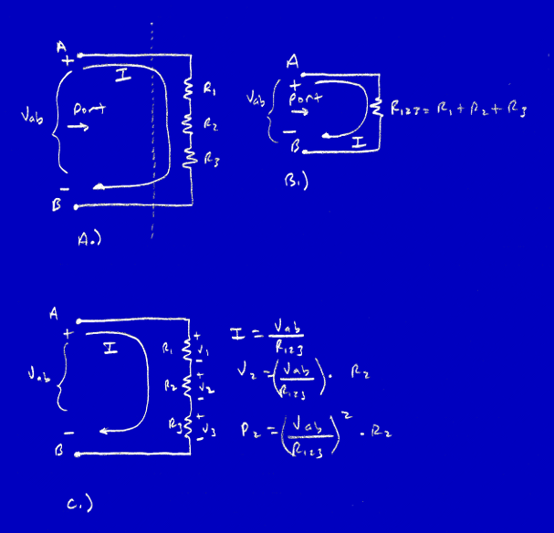
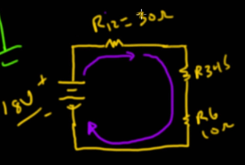

# Kirchhoffs laws and dash of common sense

* Kirchhoffs laws
    * Kirchhoffs current law (KCL)
    * Kirchhoffs voltage law (KVL)

* KCL 
    * Total arus yang masuk ke percabangan pasti sama dengan total yang keluar, namun arus akan mengalir lebih deras ke jalur yang hambatannya kecil.
    * Ketika arus melewati multiple loops.
    * Contoh: Jika 1 Ampere masuk ke percabangan dua kabel, tidak mungkin kedua kabel itu masing-masing dapat 1 Ampere. Mungkin 0.5A & 0.5A, atau 0.7A & 0.3A.
    * Itotal = I1 + I2 + I3 + ...

* KVL 
    * Dalam satu closed circuit, tegangan sumber pasti habis terpakai ("nol") karena dibagi-bagi ke setiap komponen sesuai besar hambatannya.
    * Vtotal = V1 + V2 + V3 + ...
    * intinya tegangan akan menjadi 0V

* Series and Parallel Resistors Circuit 
    * Series: 
        
        * Hambatannya diakumulasikan
        * e.g 
        * ada source Vab
        * ada 3 resistor R1, R2, R3 disusun seri
        * I = Vab / (R1 + R2 + R3)
        * V2 = I * R2 
        * P2 = V2 * I -> P2 = I^2 * R2

    * Parallel: 
        
        * Hambatannya dihitung dengan penjumlahan seper (nilai total makin kecil).
        * e.g 
        * ada source Vab
        * ada 3 resistor R1, R2 disusun parallel
        * 2 Resistor R1 dan R2 ekuivalent dengan Rtotal (resistor yang seolah-olah ada ditengah tengah R1 dan R2)
        * I1 = Vab/R1
        * I2 = Vab/R2
        * I = I1 + I2
        * __Rtotal = (R1 * R2) / (R1 + R2)__
        * e.g Vab = 5V, R1 = 100 ohm, R2 = 100 ohm
        * cara satu satu
        * I1 = 5V / 100 ohm = 0.05A = 50mA
        * I2 = 5V / 100 ohm = 0.05A = 50mA
        * I = 0.05A + 0.05A = 0.1A = 100mA
        * cara cepat
        * Rtotal = (100 * 100) / (100 + 100) = 50 ohm
        * I = 5V / 50 ohm = 0.1A = 100mA
        * arus yang mengalir dalam rangkaian 100mA tapi dalam rangkaian percabangan (2 cabang paralel) dengan KCL menjadi 50mA & 50mA

    __contoh circuit__
    * Contoh Circuit
        
        * Vtotal = V1 + V2 -> 9V + 9V = 18V
        * R12 = R1 + R2 -> 10 ohm + 20 ohm = 30 ohm
        * R34 = R3 + R4 -> 200 ohm + 1000 ohm = 1200 ohm
        * R345 = (R34*R5)/(R34 + R5) -> (1200*100)/(1200 + 100) = 92.31 ohm (parallel dicari nilainya sehingga menjadi seperti series)
        * R6 = 10 ohm
        * Itotal = Vtotal/(R12 + R345 + R6) -> 18V/(30 ohm + 92.31 ohm + 10 ohm) = 0.136A = 136mA
        * jadi rangkaian disederhanakan terlebih dahulu seperti menjadi series
        
        * jika sudah didapat arusnya (136mA), maka bisa dihitung tegangan di setiap komponen dan arus di setiap komponen dengan KVL dan KCL
        * Voltage total = 18V
        * series :
            * V1 = I1 * R1 -> 0.136A * 10 ohm = 1.36V
            * V2 = I2 * R2 -> 0.136A * 20 ohm = 2.72V
            * V6 = I6 * R6 -> 0.136A * 10 ohm = 1.36V
        * parallel :
            * V345 = I345 * R345 -> 0.136A * 92.31 ohm = 12.56V (gabungan -> jadi seperti series) (volt konstan, arus dibagi ke cabang)
            * untuk parallel dihitung dulu KCL arusnya (breakdown)
            * I5 = V5/R5 -> 12.56V/100 ohm = 0.1256A -> 125.6mA
            * KCL (136mA) -> 2 cabang -> 125.6mA dan 10.4mA
            * I34 = 10.4mA
            * V5 = I5 * R5 -> 0.1256A * 100 ohm = 12.56V
            * V3 = I3 * R3 -> 0.0104A * 200 ohm = 2.08V
            * V4 = I4 * R4 -> 0.0104A * 1000 ohm = 10.40V
            * KVL -> V1 + V2 + V6 + V345 = 1.36V + 2.72V + 1.36V + 12.56V = 17.90V -> 18V maka Vtotal = 18V terbagi ke semua komponen

__parallel itu caranya digabungkan dulu jadi seperti series (dicari jalur tengahnya (parallel digabung jadi satu)) maka akan dapat voltagenya lalu selanjutnya dibreakdown lagi per komponen didalam parallelnya__

__pada parallel arus akan dibagi sesuai cabangnya e.g 100mA ada 2 cabang bisa 40mA dan 60mA, bisa juga 50mA dan 50mA sedangkan voltage akan tetap sama e.g 12V ada 2 cabang maka setiap cabang akan memiliki 12V__
            
### urutan dalam analysis circuit : 
* pahami series dan parallelnya
* lalu sederhanakan circuit yang ada beberapa series digabung jadi satu series
* yang parallel
    * kalau ada series digabung dulu
    * lalu digabung dengan parallel seperti menjadi series (cari jalur tengahnya)
* lalu hitung Itotal (arus totalnya)
* lalu hitung tegangan per komponen (KVL) yang series terlebih dahulu
* cari tegangan totalnya (KVL) pada parallel lalu cari arusnya 
* lalu pada parallel hitung arusnya (KCL) karena arusnya kan terbagi ke setiap cabangnya 
* lalu hitung tegangan per komponen (KVL) pada parallel
* pastikan lagi kalau tegangannya sudah habis terbagi ke semua komponen 
__sourcenya ../img/2_Series_Parallel_Resistor_Practice.png dan ../img/2_Series_Parallel_Resistor_Practice_setelah_disederhanakan.png__
__diingat-ingat lagi cara analysis circuitnya apda gambar tersebut__
        
        
