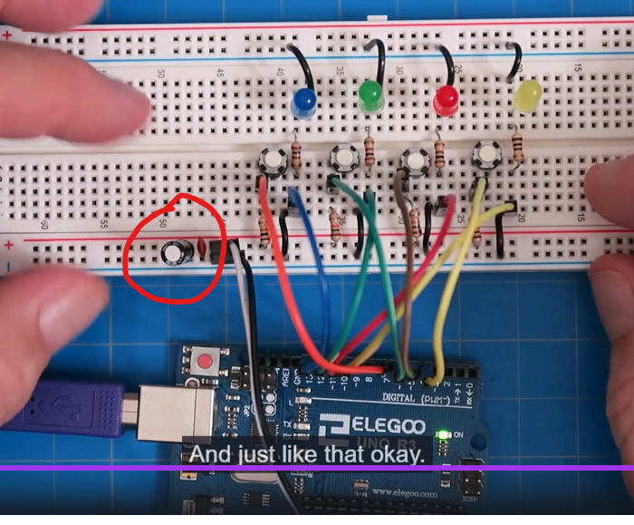

# Capacitors and AC Coupling

- Konsep
  - Simpan energi pada medan listrik
  - Tujuan: **menstabilkan tegangan**, menghilangkan noise
  - Satuannya yaitu Farad (F)
  - Komponen ini bereaksi terhadap Perubahan Tegangan.
  - t = 5 x R x C yaitu untuk menghitung waktu delay sampai Capacitor penuh dan tegangan menjadi stabil
  - Rumus 
    - Rumus charging dan discharging
      - charging
        - Vc(t) = V0 * (1 - e^(-t/RC))
        - Vc(t) = Tegangan kapasitor pada waktu ke-t, V0 = tegangan awal, t = waktu, R = resistor, C = kapasitor
      - discharging
        - Vc(t) = V0 * e^(-t/RC)
        - Vc(t) = Tegangan kapasitor pada waktu ke-t, V0 = tegangan awal, t = waktu, R = resistor, C = kapasitor
    - Rumus jumlah arus listrik yang mengalir menembus (secara efektif) kapasitor. 
      - I = C * dV/dt
      - Besar Arus (I) tergantung pada seberapa cepat Tegangan berubah (dV/dt)
      - Kasus 1: Tegangan Tiba-tiba DROP (Turun) Terjadi perubahan tegangan negatif (nilai dV/dt negatif). Berdasarkan rumus, Kapasitor menghasilkan Arus negatif (Arus keluar dari kapasitor). Efek: Arus keluar ini "menambal" kekurangan tegangan di rangkaian, sehingga tegangan tidak jadi jatuh drastis. (analogi: Jika pompa PDAM mati sebentar (Tegangan Drop), air di tandon akan turun ke pipa untuk menjaga kran tetap mengalir.)
      - Kasus 2: Tegangan Tiba-tiba SPIKE (Naik) Terjadi perubahan tegangan positif (nilai dV/dt positif). Berdasarkan rumus, Kapasitor menarik Arus positif (Arus masuk ke kapasitor). Efek: Kapasitor memakan kelebihan energi tersebut, sehingga tegangan tidak jadi melonjak tinggi. (analogi: Jika pompa PDAM menyembur terlalu kencang (Tegangan Spike), air akan masuk mengisi tandon dulu, sehingga kran tidak jebol karena tekanan tinggi.)
    
### Rangkaian Capacitor

- Low Pass RC Filter: Meloloskan sinyal pelan (Bass), membuang sinyal cepat (Treble/Noise). Dipakai untuk membersihkan sinyal sensor yang jittery (gemetar). rangkaiannya resistor dulu baru capacitor (capacitor nempel ground).
- High Pass RC Filter: Meloloskan sinyal cepat, memblokir sinyal diam (DC). Dipakai di audio amplifier agar tegangan baterai tidak masuk ke speaker. rangkaiannya capacitor dulu baru resistor. (resistor nempel ground)

### Series and Parallel Capacitor

- Parallel Capacitor
  - Ct = C1 + C2 + C3 + ...
- Series Capacitor
  - Ct = (C1 * C2) / (C1 + C2)
  - Capacitor disusun series sangat jarang sekali digunakan, mending langsung pasang capacitor yang besar

### Konsep RC Circuit

- Konsep Rangkaian RC (Resistor + Capacitor) = TIMER
- Ini adalah konsep paling vital untuk logika digital dan mikrokontroler.
- Jika Anda menghubungkan Resistor dan Kapasitor secara seri (berurutan), listrik tidak akan langsung "penuh" tapi berangsur-angsur akan penuh (charging capacitor).
- Kapasitor akan terisi secara perlahan mengikuti kurva melengkung.
- Kapasitor dianggap penuh (charging) (100%) setelah (pada detik) 5 x R(Ohm) x C(Farad).
- Jadi misal R = 100 Ohm, C = 100 uF, maka waktu tunda(timer) yang dihasilan yaitu 5 x 100 x 100 uF = 5000 uF = 5 ms.
  - Contoh:Anda menekan saklar. Lampu tidak langsung nyala terang, tapi redup dulu baru terang (charging) perlahan. Itu efek rangkaian RC. Saat sumber tegangan dicabut maka lampu tidak langsung mati tapi meredup dulu baru mati (discharging) perlahan.
  - **5 x R x C** itu adalah waktu tunda untuk **charging** sampai penuh serta tegangan sudah stabil dan waktu tunda untuk **discharging** sampai habis.

### Implementasi dari rangkaian Low Pass Filter

- Bypass / Decoupling Capacitor

  
  - Fungsi: Menstabilkan tegangan suplai ke chip.
  - Tidak perlu pakai resistor hanya capacitor
  - Lokasi Pasang: kapasitor(+) -> VCC(microcontroller)/load dan kapasitor(-) -> GND.
  - Kapan Berfungsi: Terus-menerus selama alat menyala.
  - Masalah: Chip digital (seperti ESP32) bekerja dengan kecepatan sangat tinggi. Ia menarik arus listrik secara mendadak dan terputus-putus (seperti denyut nadi yang sangat cepat). Karena kabel dari sumber listrik (baterai) memiliki hambatan, tarikan arus mendadak ini menyebabkan tegangan di kaki chip sempat turun/drop sesaat (misal dari 3.3V turun jadi 3.0V lalu naik lagi). Jika tegangan turun terlalu jauh, chip akan mati atau restart sendiri.
  - Cara kerja:
    - Kapasitor dipasang paralel (antara Positif dan Negatif) sedekat mungkin dengan chip.
    - Kapasitor ini menyimpan sedikit muatan listrik lokal.
    - Saat chip menarik arus besar secara mendadak, chip mengambil kekurangan arus dari Kapasitor tersebut, bukan menunggu dari baterai yang jauh.
    - Hasilnya, tegangan di kaki chip tetap rata dan stabil (tidak anjlok).
  - Tujuan: Mencegah tegangan drop saat kerja berat.
  - Komponen:
    - 1x Ceramic Capacitor 0.1 Micro Farad -> untuk filter frekuensi tinggi
    - 1x Electrolytic Capacitor 10 Micro Farad -> untuk filter frekuensi rendah

- Power On Reset (POR)

  - Fungsi: Menunda chip bekerja sampai tegangan stabil.
  - Lokasi Pasang: Di kaki RESET chip.
  - Rangkaian umum -> Input masuk ke Resistor, lalu kaki Kapasitor disambung ke Ground. Output diambil di antara R dan C.
  - Kapan Berfungsi: Hanya satu kali, yaitu saat alat baru dinyalakan.
  - Masalah: Saat Anda menyalakan alat, tegangan listrik dari baterai atau adaptor tidak langsung stabil (misal langsung 5 Volt). Tegangan itu naik secara bertahap (0V -> 2V -> 4V -> 5V). Jika chip (otak) dipaksa bekerja saat tegangan masih rendah (misal di 2V), chip bisa error atau macet.
  - Cara kerja:
    - Rangkaian POR (Resistor + Kapasitor) dipasang di kaki RESET chip.
    - Saat listrik baru masuk, Kapasitor butuh waktu untuk terisi tegangan.
    - Selama Kapasitor belum penuh, ia akan mengirim sinyal 0 (LOW) ke kaki Reset. Ini memaksa chip untuk "diam" dulu.
    - Setelah beberapa milidetik, Kapasitor penuh. Sinyal berubah menjadi 1 (HIGH).
    - Chip berhenti di-Reset dan mulai bekerja. Saat ini, tegangan sumber listrik dipastikan sudah stabil di 5V.
  - Tujuan: Memberi jeda waktu start-up.

- Switch Debouncing (Peredam Tombol)
  - Fungsi: Membersihkan sinyal "kotor" dari tombol/switch agar terbaca sebagai satu kali tekanan yang bersih (menghilangkan noise).
  - Lokasi Pasang: Di antara Tombol Fisik dan Pin Input (GPIO) mikrokontroler.
  - Kapan Berfungsi: Setiap kali tombol ditekan atau dilepas.
  - Masalah: Tombol fisik terbuat dari pelat logam. Saat ditekan, logam tersebut tidak langsung menempel sempurna, melainkan "membal" (bouncing) atau bergetar selama beberapa milidetik (seperti bola pingpong yang dijatuhkan). Chip yang kerjanya super cepat (MHz) akan membaca getaran ini sebagai sinyal: Nyambung-Putus-Nyambung-Putus berulang kali dalam waktu singkat. Akibatnya, satu kali tekan tombol bisa terbaca sebagai 10 kali klik oleh program.
  - Cara kerja:
    - Rangkaian RC (Resistor + Kapasitor) dipasang di jalur input tombol.
    - Saat tombol ditekan dan kontak logam bergetar (membuat sinyal naik-turun cepat/High Frequency), Kapasitor bertindak sebagai "Shock Breaker" atau peredam kejut.
    - Kapasitor akan menyerap lonjakan-lonjakan tegangan cepat tersebut (membuangnya ke Ground).
    - Kapasitor memaksa tegangan input berubah secara halus/melengkung, bukan patah-patah tajam mengikuti getaran tombol.
    - Chip mikrokontroler akhirnya hanya melihat satu perubahan logika yang mulus (misal dari HIGH ke LOW) tanpa gangguan getaran.
  - Tujuan: Mencegah double-click hantu atau pembacaan input yang error.

- Inti dari Implementasi Low Pass Filter diatas yaitu:
- **"Blokir perubahan yang terlalu cepat (Frekuensi Tinggi), dan loloskan kondisi yang stabil/lambat (Frekuensi Rendah/DC)."**

**intinya kalau series dan parallel itu disederhanakan dulu**

**implementasi utama capacitor yaitu Bypass, POR, Debouncing**

**dalam rangkaian RC bisa lebih dari 1 resistor dan lebih dari 1 capacitor**

**ukuran resistor dan capacitor mempengaruhi waktu tunda timer**

Q = C * V

**saat charging dari power +, saat discharge dari capacitor + (balik)"**

**Capacitor bekerja ketika tegangan berubah**
