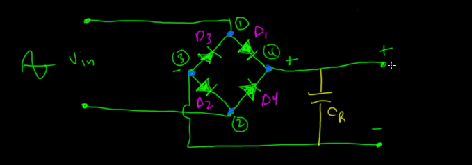

# Diodes

- Komponen yang membuat arus menjadi satu arah.
- Dioda adalah pintu berat yang butuh biaya untuk dibuka.

### Tipe Dioda
- Dioda Silikon (1N4001): Penjaga standar. Kuat, murah, tapi minta bayaran (drop voltage -> Vf) 0.7V. Cocok untuk penggunaan umum.
- Dioda Schottky: Penjaga yang gesit dan murah hati. Dia membuka pintu lebih cepat dan hanya minta bayaran kecil (0.2V - 0.3V). Tapi, dia tidak sekuat silikon menahan tekanan balik yang besar.
- Dioda Zener (regulator): Penjaga "Safety Valve". Dia bekerja normal (satu arah), TAPI jika tekanan dari arah berlawanan terlalu besar (misal melebihi 5.1V), dia sengaja jebol (breakdown) untuk membuang kelebihan tekanan itu demi keamanan. Ini dipakai untuk Regulasi Tegangan. Jadi akan menggunakan tegangan yang tertera di zener diode.

### AC ke DC

- Full-Wave Bridge Rectifier (4 Dioda) -> Dioda disusun seperti diamond sehingga menghasilkan arus DC dari AC
- Capacitor ripple setelah bridge rectifier -> karena tegangan yang keluar dari bridge rectifier masih naik turun maka perlu capacitor ripple sehingga tegangan tidak pernah jatuh ke nol dan menjadi lurus rata.

### Fungsi lain diode
- karena memakan pajak 0.7V bisa dimanfaatkan untuk menurunkan tegangan dengan diode yang disusun seri. (tapi dirty voltage regulator).

### Hitungan Capacitor agar smooth
- rumus
    - C = I/f*Vripple
    - C -> capacitor
    - I -> arus yang diperlukan oleh komponen
    - f -> frekuensi
    - Vripple -> Tegangan riak (naik-turun) yang "boleh" terjadi (dalam Volt).
- e.g
    - komponen perlu 500 mA 
    - frekuensi di Indonesia 50 Hz
    - tegangan 12 VAC
    - maka
        - I = 500 mA -> 0.5 A
        - f = 50 Hz -> 100 Hz
        - Vripple - 1 Hz (mau halus)
        - C = I/f*V -> 0.5/100*1
        - C = 0.005 F -> 5000 µF (micro Farrad)