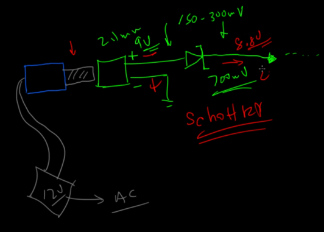
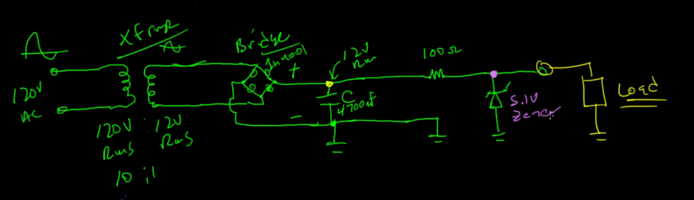
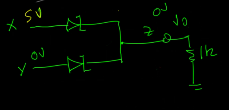

# Zener and Schottky Diode

### Zener Diode

- Zener Diode: "Si Jalur Pembuangan" (DIPASANG PARALEL/SHUNT)
- pada rangkaian yang dilewatinya akan menggunakan tegangan yang tertera di zener (5.1V)
- tegangan sisanya masuk ke resistor yang dipasang sebelum zener
- sisa arus masuk ke ground
- zener itu untuk regulasi tegangan.
- rangkainnya - masuk ground, + untuk output (seperti voltage divider)
- analogi :
    - Bayangkan Zener sebagai Bendungan Air dengan ketinggian tembok tepat 5.1 meter (untuk Zener 5.1V).
    - Air Masuk (Input Voltage): Bayangkan air banjir setinggi 12 meter datang.
    - Peran Zener: Dia menahan air, TAPI begitu air melebihi 5.1 meter, kelebihannya dibiarkan tumpah ke sungai pembuangan (Ground).- Hasil (Output): Di balik bendungan, ketinggian air akan selalu stabil di 5.1 meter, tidak peduli seberapa deras banjir di depan (selama banjirnya di atas 5.1 meter).
- hitungan :
    - Vs = 12V
    - Zener = 5.1V
    - Resistor akan dapat tegangan = Vs - Zener = 6.9V
    - maka tegangan yang digunakan pada rangkaian setelah zener yaitu 5.1V
    - nilai resistornya berapa?
        - tergantung beban di output. e.g LED maka perlu 20mA
        - arus di zener 5mA (optional, biasanya tidak perlu dihitung)
        - total arus = 25mA
        - maka R = V/I -> 6.9V/0.025A -> 276 Ohm maka bisa pakai 270 Ohm atau 330 Ohm

### Schottky Diode

- Schottky Diode: "Si Satpam Pintu Masuk" (DIPASANG SERI)
- hampir sama seperti silikon diode namun kalau silikon diode makan 0.7V maka schottky diode hanya 0.2V-0.3V
- namun tidak sekuat silikon diode dalam menahan tegangan balik
- rangkaiannya dibuat seri dari Vsource 

### Cicuit AC to DC

### Wire "OR"

- 2 Vsource bisa digabung dengan membuat logic "OR"
- biasanya menggunakan schottky diode karena memakan voltage yang kecil
- rangkaiannya
    - Vs1 dan Vs2 dikasih diode masing-masing
    - e.g Vs1 5V dan Vs2 0V maka tegangan dan arus tidak akan masuk ke Vs2 karena ada diode