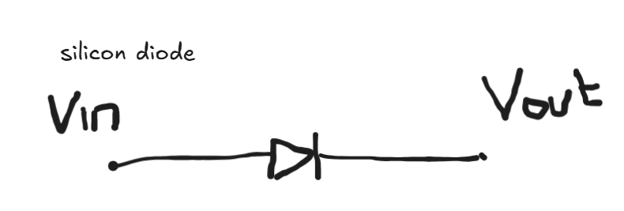
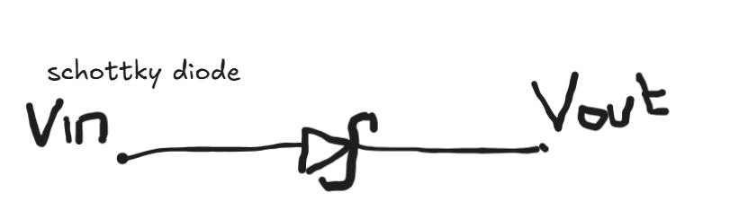
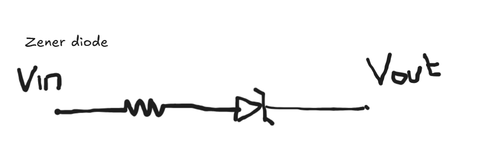
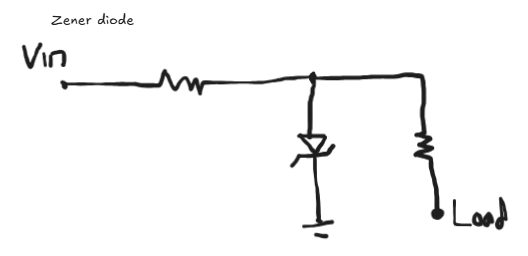

# Rangkaian 

### Silicon Diode dan Schottky Diode

- Seri 
    - Diode menjadi voltage dropper
    - silicon ngedrop 0.7-0.8V
    - schottky ngedrop lebih kecil sekitar 0.2-0.3V
    - Vout = Vin -Vdiode
- Full-Wave Rectifier
    - Diode yang disusun 4 memiliki fungsi mengubah AC menjadi DC 
    - tapi perlu ditambah Capacitor Ripple 
        - untuk membuat signal menjadi DC murni (lurus mulus), 
        - Tanpa kapasitor, outputnya adalah DC yang berdenyut (naik-turun ke 0V).
        - Semakin besar nilai kapasitor (Farad), semakin halus (lurus) garis DC-nya.

### Zener Diode

- Seri
    - zener berfungsi sebagai voltage dropper 
    - Vout = Vin - Vzener
    - Jadi tegangan yang keluar merupakan tegangan masuk yang sudah dikurangi tegangan dari zener

- Paralel
    - zener berfungsi sebagai voltage regulator
    - wajib ada resistor yang dipasang secara seri terlebih dahulu
    - Rseri = (Vin - Vzener)/(Ibeban + Izener) 
    - Vout = Vzener
    - jadi tegangan yang dipakai dirangkaian akan sesuai dengan tegangan dari zener
    - tegangan masuk 12V lalu dipasang zener dengan tegangan 5V, maka tegangan sebesar 7V akan drop (dipakai) pada resistor seri dan rangkaian beban (load) hanya memakai 5V
    - ketika tegangan masuk dibawah tegangan zener, e.g tegangan masuk 3V dan tegangan zener 5V maka yang dipakai full 3V

### Rangkaian Wire "OR"

- 2 Vsource bisa digabung dengan membuat logic "OR"
- biasanya menggunakan schottky diode karena memakan voltage yang kecil
- rangkaiannya
    - Vs1 dan Vs2 dikasih diode masing-masing
    - e.g Vs1 5V dan Vs2 0V maka tegangan dan arus tidak akan masuk ke Vs2 karena ada diode