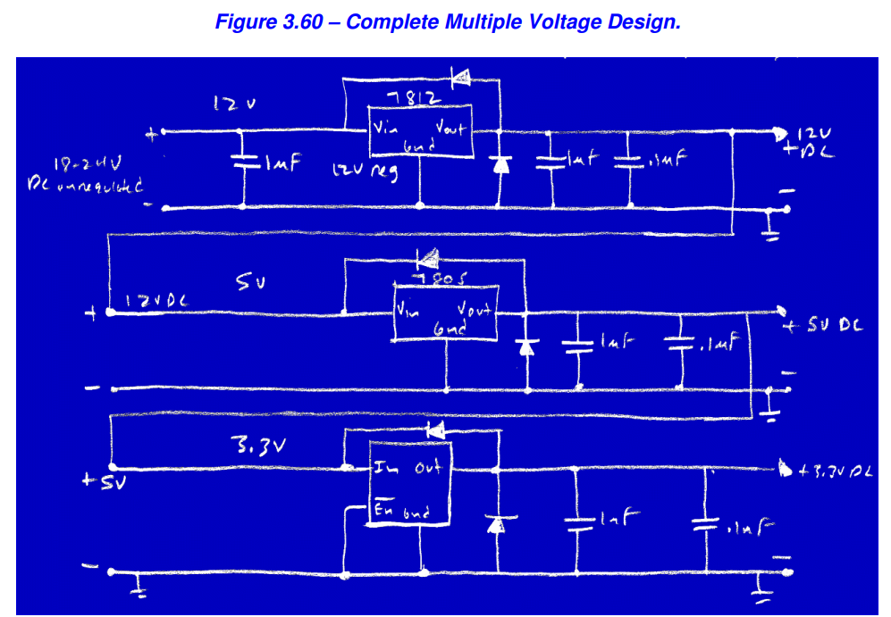

# Power Supply Primer

-- PLN
- Listrik PLN (AC 220V)
-- Adapter
- Trafo -> menurunkan VAC PLN (AC 12V)
- Bridge Rectifier -> membuat menjadi VDC tapi masih kembali ke 0V (DC 12V)
- Capacitor Ripple -> membuat VDC tidak kembali ke 0V (DC 12V)
- Switching Regulator -> menurunkan VDC (Tapi masih agak bergerigi) (DC 7V)
-- Perantara
- LDO -> menurunkan VDC dan membuat VDC sangat stabil/halus (DC 5V)
-- Ending
- VIN MCU (DC 3.3V)

### Deep Dives bagian LDO 
- dibagian LDO ini ouputnya yang masuk ke pin VIN MCU
- Alur
    - Input dari Switching Regulator (e.g 7V)
    - Lalu pasang kapasitor ganda di input (sebelum masuk LDO(IC)) (bypass)
        - kapasitor elco (10uF/47uF) -> untuk membuang frekuensi rendah dan Bertindak sebagai "tangki cadangan" energi saat beban mendadak naik (misal saat ESP32 menyalakan WiFi).
        - kapasitor keramik (0.1uF/100nF) -> untuk membuang frekuensi tinggi
    - Pasang LDO/IC dengan heatsink (untuk mengurangi panas) (heatsink itu opsional)
        - Pastikan (Vin - Vout) > Dropout Voltage (misal AMS1117 butuh selisih ~1.1V). Input 7V ke Output 5V adalah margin yang aman.
        - LDO itu 3 Pin -> Input, Ground, Output (model menyesuaikan e.g AMS1117 (gnd, out, in))
        - heatsink perlu ketika wattnya tinggi
            - PD = (Vin - Vout) * Iload
            - kalau 2 Watt maka sudah termasuk panas
    - Pasang Diode (2 buah) (diode itu opsional)
        - Dioda 1 (Output ke Input - Reverse):
            - Fungsi: Discharge Protection.
            - Logika: Saat listrik dimatikan, tegangan input (kaki 1) akan drop ke 0V lebih cepat daripada output (karena ada kapasitor di output yang masih menyimpan muatan). Tanpa dioda ini, arus akan mengalir balik dari Output ke Input menembus IC LDO dan bisa merusaknya. Dioda ini membuang arus tersebut dengan aman.
            - Tipe Dioda: 1N4007 (umum) atau 1N5819 (Schottky - lebih cepat).
        - Dioda 2 (Output ke Ground - Reverse Bias):
            - Fungsi: Reverse Polarity Protection (pada output).
            - Logika: Ini melindungi jika ada tegangan negatif yang tidak sengaja masuk ke rail 5V, atau seringkali digunakan Transient Voltage Suppressor (TVS) diode untuk melindungi dari lonjakan tegangan statis. Jika hanya dioda biasa (1N4007) dipasang reverse (Katoda di +, Anoda di Gnd), ia akan menahan tegangan agar tidak negatif.
            - Tipe Dioda: 1N4007 (umum) atau 1N5819 (Schottky - lebih cepat).
    - Lalu pasang kapasitor ganda di output (sebelum keluar LDO(IC)) (bypass) (.e.g output LDO 5V masuk ke pin VIN (bukan VCC) MCU, lalu AMS onboard mengubahnya menjadi 3.3V untuk otak chip MCU)
        - kapasitor elco (10uF/47uF) -> untuk membuang frekuensi rendah dan Bertindak sebagai "tangki cadangan" energi saat beban mendadak naik (misal saat ESP32 menyalakan WiFi).
        - kapasitor keramik (0.1uF/100nF) -> untuk membuang frekuensi tinggi

### Multiple Voltage Design

- ada vDC 18V mau dibuat agar dapat menghasilkan 12V, 5V, dan 3.3V.
- komponen:
    - LM7812 -> untuk dapat 12V 
    - LM7805 -> untuk dapat 5V
    - TPPM0110 -> untuk dapat 3.3V