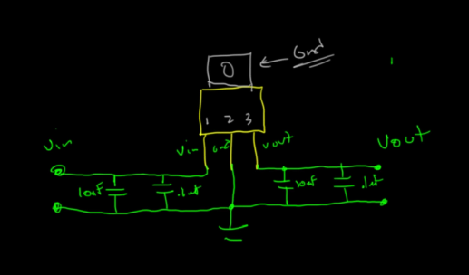
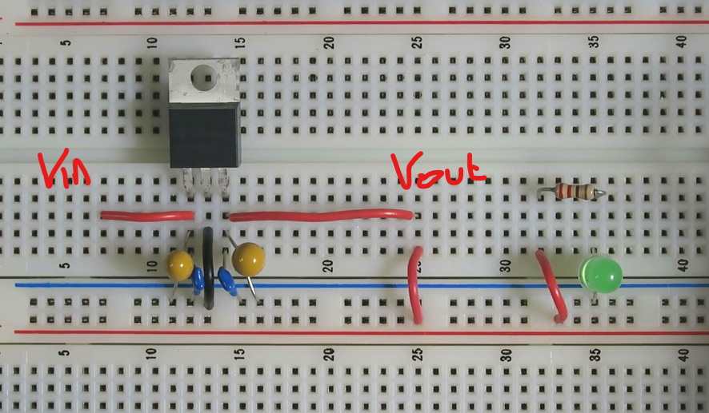

# 5V Power Supply menggunakan 7805

- Perantara
- 7805 itu masuk linear regulator
- 7805 memakan voltage (voltage drop) sebanyak 2V, maka input minimal 7V kalau outputnya mau 5V
- Adapter kadang tertulis output 9V DC namun saat diukur malah outputnya 13V-14V, bisa membuat regulator terbakar, Makanya dipastikan dulu

### Resep
- resep "Minimalis tapi Stabil" tinggal pakai ini saja:
    - IC 7805 (Jantungnya).
    - 4 Buah Kapasitor (2 di Input, 2 di Output).

### Rangkaian dari adaptor wall (9V atau 7V) ke 5V

- Input dan Output dari 7805
    - Kapasitor Besar (10µF - elco/Tantalum): Ini adalah "Tangki Cadangan". Menangani lonjakan arus besar yang lambat (frekuensi rendah).
    - Kapasitor Kecil (0.1µF - Keramik): Ini adalah "Filter Halus". Menangani noise frekuensi tinggi yang sangat cepat.
    - Posisi: Wajib sedekat mungkin dengan pin input IC regulator (7805).

