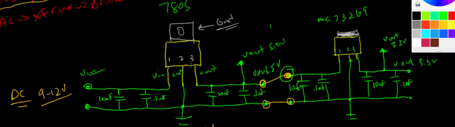
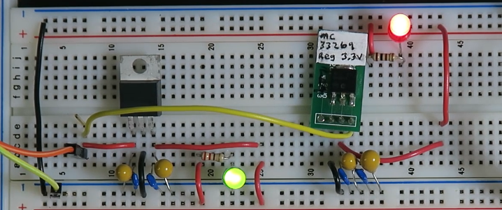

# 3.3V Power Supply

- Perantara
- bisa pakai LDO 7833, AMS1117-3.3 (SMD) untuk output 3.3V
- terkait pin lihat datasheet komponennya

### Cara Buat

- Daisy Chain
    - alur: sumber -> 5V -> 3.3V
    - regulator dingin
    - di input dan ouput dipasang capacitor ganda
        - Kapasitor Besar (10µF - elco/Tantalum): Ini adalah "Tangki Cadangan". Menangani lonjakan arus besar yang lambat (frekuensi rendah).
        - Kapasitor Kecil (0.1µF - Keramik): Ini adalah "Filter Halus". Menangani noise frekuensi tinggi yang sangat cepat.
        - ditaruh sedekat mungkin dengan pin input regulator.

- Paralel
    - alur: sumber -> 5V dan sumber -> 3.3V
    - regulator panas