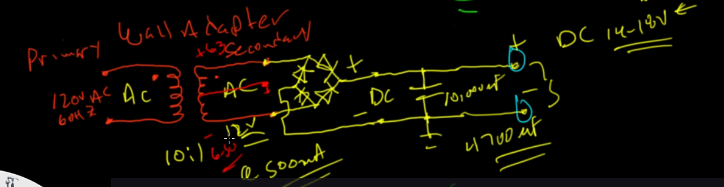
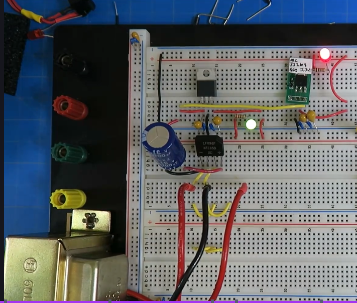
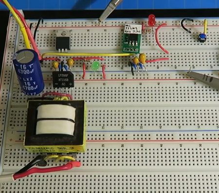

# Transformer

- Adapter
- penggunaan tranfomer dari AC

### Alur Adapter

- PLN VAC
- Transformer (menurunkan VAC)
- Bridge Rectifier (membuat menjadi VDC tapi masih kembali ke 0V)
- Capacitor Ripple (membuat VDC tidak kembali ke 0V)
- Switching Regulator (menurunkan VDC)

### Transformer
- e.g 3FD-312, FS12-090
- dibuat paralel atau series itu terkait menyambungkan pinnya
- primary itu inputnya(gulungan 1) dan secondary itu outputnya(gulungan 2)

### e.g

- primary dipasang paralel
- secondary dipasang paralel