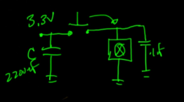
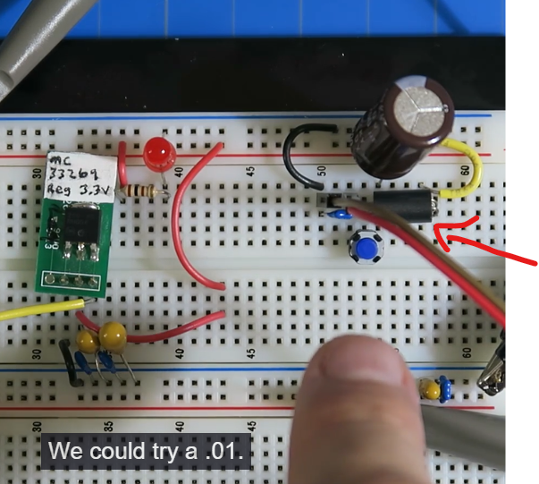

# Filtering Power Supply

### Masalah
- Masalah utamanya adalah: Regulator tegangan (seperti 7805 atau LDO) saja TIDAK CUKUP jika bebanmu adalah induktif (seperti motor/pompa).
- Motor itu "kotor". Saat berputar, dia menciptakan noise frekuensi tinggi dan saat dimatikan/dinyalakan, dia "menendang" balik arus (inductive kickback). Ini membuat tegangan di jalur 3.3V atau 5V jadi kotor (berduri-duri di osiloskop), yang bisa membuat mikrokontroler (seperti ESP32 di project NAS kamu) hang atau restart sendiri.

### Solusi
- 1. Kapasitor: "Si Penampung & Si Penyaring"
    
    - butuh dua jenis kapasitor secara paralel (bypass decoupling):
        - Kapasitor Besar (misal 2200µF): Ini adalah "tangki cadangan". Saat motor pertama kali nyala (start-up), dia menyedot arus besar. Tanpa kapasitor ini, tegangan akan drop sesaat (brownout). Kapasitor ini menambal kekurangan itu.
        - Kapasitor Kecil (0.1µF): Ini adalah "jalur pembuangan" untuk noise. Noise motor itu frekuensinya tinggi. Bagi frekuensi tinggi, kapasitor kecil ini terlihat seperti jalan pintas (short circuit) ke Ground. Jadi, noise-nya dibuang ke tanah sebelum masuk ke sistem digitalmu.

- 2. Ferrite Bead
    
    - Ferrite Bead adalah induktor yang unik. Cara kerjanya:
        - Untuk Arus DC (Listrik stabil): Dia seperti kawat biasa (hambatan nol). Listrik lewat lancar.
        - Untuk Arus AC/Noise (Frekuensi tinggi): Dia berubah menjadi resistor (hambatan tinggi).

- 3. Proteksi Ekstra (Untuk Power Supply "Pro")
    - Agar power supply buatanmu tahan banting (profesional), tambahkan dua hal di input:
        - TVS (Transient Voltage Suppressor): Seperti Zener Diode tapi super cepat. Jika ada lonjakan tegangan tiba-tiba (misal sambaran petir tidak langsung atau lonjakan jala-jala), dia akan memotong (clamp) tegangan berlebih itu dalam hitungan nanodetik agar komponen lain tidak gosong.
        - PTC Fuse (Polyfuse): Sekring yang bisa "sembuh sendiri". Jika arus terlalu besar (korsleting), dia memanas dan memutus arus. Setelah dingin, dia nyambung lagi.