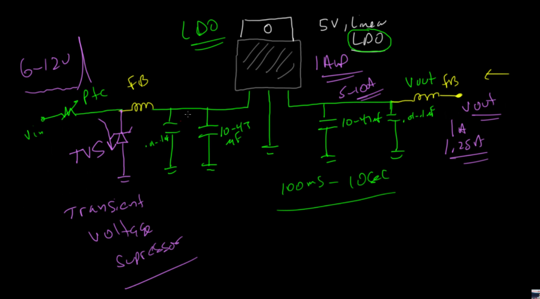

# Alur Power Supply

### ZONA 1: Konversi Kasar (AC ke DC Mentah)
__Ini biasanya ada di dalam kotak adaptor/wall wart atau bagian power supply utama.__

1. PLN (220V AC)
2. Trafo (Turun ke 12V AC)
    - Posisi: SERI (Induksi). Sisi primer terhubung ke PLN, sisi sekunder terhubung ke Bridge. Tidak ada yang langsung short ke GND di jalur utama.
3. Bridge Rectifier (Ubah ke DC gelombang)
    - Posisi: Input AC masuk, Output + dan - keluar.
4. Capacitor Ripple (Elco Besar) (Ratakan jadi DC 12V - tapi masih ada ripple)
    - Posisi: PARALEL.
        - Kaki positif (+) nyambung ke jalur positif 12V.
        - Kaki negatif (-) nyambung ke Ground (GND).
        - Alasan: Dia bertindak sebagai "tandon air" penampung muatan.

### ZONA 2: Proteksi & Pra-Regulasi
1. PTC Fuse
    - Posisi: Tepat setelah colokan DC Jack. SERI.
        - Koneksi: Jack DC (+) -> Kaki 1 PTC -> Kaki 2 PTC -> Masuk ke rangkaian.
        - Alasan: Dia bertindak sebagai "jembatan". Jika arus berlebih/panas, jembatan putus (resistansi naik tinggi) untuk memutus aliran listrik ke sirkuit selanjutnya.
        - Jangan diparalel ke GND, nanti konslet.
    - Fungsi: Kalau ada korsleting di PCB kamu, dia putus duluan sebelum adaptor atau trafo kamu terbakar.

2. TVS Diode
    - Posisi: Setelah Fuse. PARALEL (Biasanya Uni-directional untuk DC).
        - Koneksi: Jalur Positif (setelah Fuse) -> Kaki Katoda (Garis) -> Kaki Anoda -> Ground (GND).
        - Alasan: Dia bertindak sebagai "katup pembuangan". Saat ada lonjakan tegangan (petir/surge), dia akan short sebentar untuk membuang kelebihan tegangan itu ke tanah (GND), sehingga Fuse di depannya putus.
        - PENTING: Harus dipasang setelah Fuse.
    - Fungsi: Kalau tiba-tiba ada petir atau lonjakan listrik dari adaptor, dia "makan" lonjakannya biar gak ngerusak regulator.

3. Switching Regulator (Opsional tapi bagus)
    - Fungsi: Turunkan 12V ke 7V dengan efisien (tidak panas).
    - Posisi: 3 KAKI (IN-GND-OUT).
        - Input (VIN): Menerima dari jalur positif sebelumnya.
        - Ground (GND): Paralel ke Ground utama.
        - Output (VOUT): Lanjut ke komponen berikutnya.

4. Ferrite Bead (L)
    - Posisi: Setelah Regulator.Di jalur positif sebelum masuk LDO. SERI.
        - Koneksi: Output Switching Reg -> Kaki 1 Ferrite -> Kaki 2 Ferrite -> Input LDO.
        - Alasan: Dia bertindak sebagai "penyaring" di dalam pipa. Frekuensi tinggi (noise) ditahan (diubah jadi panas), arus DC bersih dibiarkan lewat.
    - Fungsi: Memblokir noise frekuensi tinggi dari Switching Regulator (karena switching itu berisik) atau dari kabel panjang, supaya tidak masuk ke LDO.

### ZONA 3: Regulasi Halus (Final Stage)
__Ini zona suci untuk MCU__

1. Kapasitor Input LDO (Besar + Kecil/Bypass) 
    - Posisi: Tepat di kaki input LDO. PARALEL.
        - Koneksi: Jalur positif (sebelum masuk kaki IN LDO) -> Kaki (+) Kapasitor -> Kaki (-) -> Ground (GND).
        - Posisi: Sedekat mungkin dengan kaki input LDO.
    - Fungsi: Decoupling & Bypass noise sisa-sisa.

2. LDO (Linear Regulator) 
    - Fungsi: Menurunkan 7V ke 3.3V (atau 5V) dengan sangat halus/stabil. LDO membuang sisa noise (Ripple Rejection).
    - Posisi: 3 KAKI (IN-GND-OUT).
        - Input (VIN): Menerima tegangan 7V (dari Ferrite).
        - Ground (GND): Paralel ke Ground.
        - Output (VOUT): Mengeluarkan 3.3V ke MCU.

3. Kapasitor Output LDO
    - Fungsi: Menjaga kestabilan output LDO.
    - Posisi: PARALEL.
        - Koneksi: Jalur Output LDO (3.3V) -> Kaki (+) Kapasitor -> Kaki (-) -> Ground (GND).
        - Alasan: Menyimpan cadangan energi instan untuk MCU dan membuang noise frekuensi tinggi ke tanah.

4. MCU (ESP32) 
    - Hasil: Mendapat suplai 3.3V yang super bersih dan stabil.
    - Posisi: BEBAN (LOAD).
        - VCC (3V3): Ke Output LDO.
        - GND: Ke Ground.

### e.g PTC Fuse to output LDO
