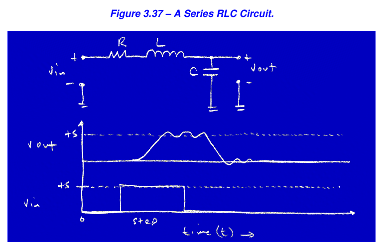
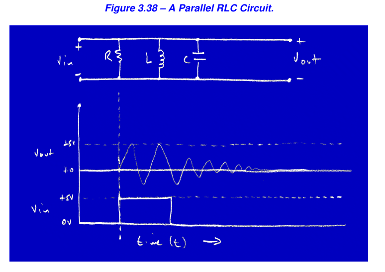

# RC and RL Circuits

## Dalam pembuatan PCB perlu diperhatikan jalurnya karena bisa ada rangkaian RLC (parasitik) yang bisa merusak sinyal digital.

## jenis yang aman yang RC dan RL
### RC Circuit
- t = 5 x R x C yaitu untuk menghitung waktu delay sampai Capacitor penuh dan tegangan menjadi stabil
- Rumus 
  - I = C * dV/dt
  - Besar Arus (I) tergantung pada seberapa cepat Tegangan berubah (dV/dt)

### RL Circuit
- t = 5 x L x R yaitu untuk menghitung waktu delay sampai Inductor penuh dan tegangan menjadi stabil
- Rumus 
  - V = L * dI/dt
  - Besar Tegangan (V) tergantung pada seberapa cepat Arus berubah (dI/dt)

## jenis yang tidak aman RLC 

- Series RLC (Bahaya pada Jalur Data)
  - Terjadi pada kabel panjang atau jalur PCB antar-chip.
  - Konsep: Jalur memiliki Induktansi (L) parasit. Saat sinyal digital berubah cepat (0 ke 1), Induktor memaksa arus terus mengalir sehingga tegangan "kebablasan" (overshoot) melewati target, lalu memantul-mantul (ringing) sebelum stabil.
  - Akibat:
    - Data Corrupt: Sinyal yang "memantul" turun bisa terbaca sebagai logika '0' padahal harusnya '1'.
    - Kerusakan Fisik: Lonjakan tegangan (spike) saat overshoot bisa menjebol isolasi transistor di dalam chip.
  - Cara Atasi:
    - Perpendek Jalur: Kurangi panjang kabel/PCB untuk membuang Induktansi (L).
    - Series Termination: Tambahkan Resistor kecil (misal 22Ω - 33Ω) secara seri di dekat sumber sinyal. Resistor ini bertugas "meredam" pantulan energi agar sinyal cepat tenang.

- Parallel RLC (Bahaya pada Power Supply)
  - Terjadi pada rangkaian filter atau input daya.
  - Konsep: Disebut "Tank Circuit". Energi listrik terjebak ping-pong bolak-balik antara Kapasitor dan Induktor. Tanpa peredam, sirkuit ini menjadi osilator (pembangkit gelombang) yang bergetar terus menerus.
  - Akibat:
    - Noise/Ripple: Tegangan DC menjadi tidak rata (bergelombang), menyebabkan sistem tidak stabil (sering restart/hang).
    - EMI (Interferensi): Sirkuit Anda berubah menjadi pemancar radio liar yang mengganggu alat elektronik lain.
  - Cara Atasi:
    - Damping (Peredaman): Pilih kapasitor yang memiliki sedikit resistansi internal (ESR) atau tambahkan resistor paralel untuk membuang energi osilasi.
    - Desain Layout: Dekatkan kapasitor (decoupling) ke pin power IC untuk memperkecil loop induktansi yang terbentuk.
