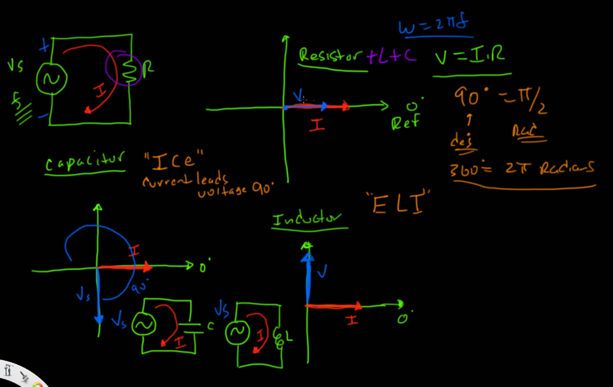

# AC

### Sinyal AC
- rumus untuk mendeskripsikan perilaku AC yang berubah-ubah.
- V(t) = A * sin(ωt + φ)
- cara baca:
  - "Sinyal ini tingginya segini (A), getarnya secepat ini (ω), dan posisinya sekarang ada di sudut sekian (φ)."

### PHASOR (Phase Vector)
- menghilangkan sin(ωt) dan hanya ambil A dan φ karena nilai sin(ωt) sama terus.
- sehingga e.g V(t) = A * sin(ωt + φ) dapat ditulis sebagai V = A∠φ (A pada sudut φ derajat), bisa untuk arus dengan I = B∠φ(B pada sudut φ derajat), A dan B adalah amplitudo dari sinyal AC.

- R, L, C saat dialiri AC
  - pada rangkaian AC, resistor kan I dan V pada satu phase maka bisa pakai ohm's law, namun pada induktor dan kapasitor yang I dan Vnya tidak satu phase tetap masih bisa pakai ohm's law tapi lebih tepatnya dengan memperhatikan reactance (X) dan impedance (Z).
  - pada induktor dan kapasitor kan dirangkaian tidak ada resistor maka dalam menentukan arus menggunakan reactance.
  
### Perbedaan 
- Resistor (R): Menghambat arus dengan cara "gesekan" elektron, yang sifatnya tetap/konstan tidak peduli seberapa cepat frekuensi arusnya.
- Reaktansi (X): Menghambat arus akibat reaksi penyimpanan energi (medan listrik atau magnet), dan nilainya berubah-ubah tergantung frekuensi sinyal AC. 
**frekuensi itu Hz -> seberapa sering berubah dalam satu detik**

### Reactance(X)
- adalah hambatan yang muncul bukan karena gesekan elektron (seperti pada Resistor), melainkan karena reaksi komponen terhadap perubahan arus atau tegangan.
- Capacitor:
  - Xc = 1 / (ωC)
  - mekanisme:
    - Frekuensi Rendah: Tegangan berubah lambat. Kapasitor punya banyak waktu hingga penuh. Saat penuh, arus berhenti mengalir (terblokir). Hambatan (Xc) besar.
    - Frekuensi Tinggi: Tegangan bolak-balik sangat cepat. Kapasitor belum sempat penuh, arah arus sudah berbalik lagi. Karena tidak pernah penuh, arus terus mengalir leluasa bolak-balik. Hambatan (Xc) menjadi kecil.
  - f tinggi, Xc kecil
  - f turun, Xc besar
- Inductor:
  - XL = ωL
  - mekanisme:
    - Frekuensi Rendah: Arus berubah pelan-pelan. Tegangan lawan yang dihasilkan kecil. Hambatan (XL) kecil.
    - Frekuensi Tinggi: Arus berubah sangat cepat. Induktor merespons dengan menciptakan tegangan lawan yang sangat besar untuk melawan perubahan itu. Akibatnya, arus sulit lewat. Hambatan (XL) menjadi besar.
  - f tinggi, XL besar
  - f turun, XL kecil
